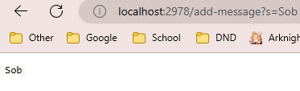
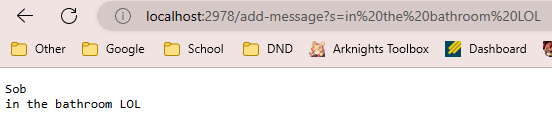

# Lab Report 2 | Servers and Bug
## Part 1 | Using a Server



## Part 2 | Examining ArrayTests.java Bug
*Failure Inducing Input*
```
 @Test
  public void testReversed() {
    int[] input2 = {3,4,5,6,7,8,9};
    assertArrayEquals(new int[]{9,8,7,6,5,4,3}, ArrayExamples.reversed(input2));
  }
```
*Successful Inducing Input*
```
@Test
  public void testReversed() {
    int[] input1 = {0};
    assertArrayEquals(new int[]{0}, ArrayExamples.reversed(input1));
```
*The Symptom*
*The Bug*
