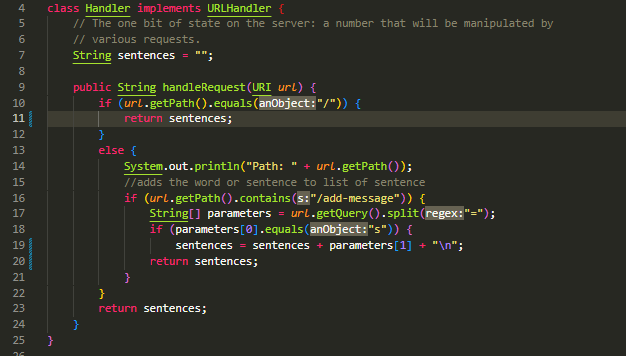
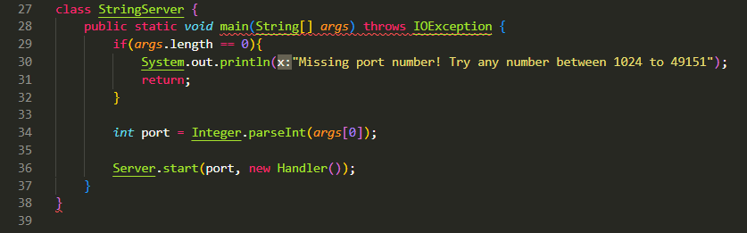
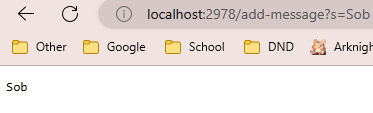
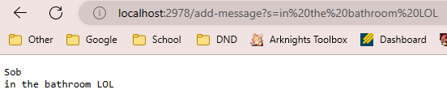
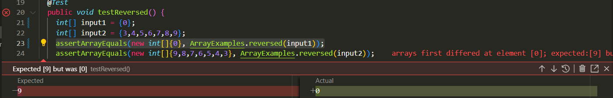

# Lab Report 2 | Servers and Bug
## Part 1 | Using a Server

1) The code web server for `StringServer.java` that will allow the user to add messages. I ripped most of the code from `Server.java` to help aid me




2) Screenshot of using `/add-message` on the URL that added the text "Sob"



- The method that is called is `public String handleRequest`, which checks the URl if it contains `/` and will return the list of messages that have been inputted. Which in this case before using `/add-message` it was empty. The method will then get the path of the URL and see if it contains `/add-message`. If the path does contain `/add-message` it will grab the Query part of the URL and split at the `=` into two parameters. It will check if parameter at index [0] contains `s`, and if it does it will concatenate the String that was grabbed from the query in index [1] and store it into the varaible `sentences` that will contain all hte mesasges inputted by the ced by `/add-message`.
- The relevant argument to the method was `sentences`, string parameteres [0] and [1]. and the URI URL. `sentences` is a empty string variable at the start of the webserver, but when when the user use `/add-message` correctly it will concatenate the string to `sentences` and will call `/n` to make a new tab for the next message that the user inputs. In the above code sob will be in parameter [1] that was obtained from the query and will concatenate into `sentences`
- The value of `sentences` will always be updated whenever `/add-message` is called successfully. Storing and returning all the inputs from the user.

3) Screenshot of using `/add-message` on the URL to add "in the bathroom LOL"



## Part 2 | Examining ArrayTests.java Bug
I chose to examine the bug from testReversed() method from ArrayExamples.java

**Failure Inducing Input**

A failure inducing input was just any int array with non-zero numbers (EX: {3,4,5,6,7,8,9}). The expected output was 9, but the actual input came out to be 0.
```
 @Test
  public void testReversed() {
    int[] input2 = {3,4,5,6,7,8,9};
    assertArrayEquals(new int[]{9,8,7,6,5,4,3}, ArrayExamples.reversed(input2));
  }
```
**Successful Inducing Input**

A successful input is any int array with 0's (EX: {0}). The expected output was 0, which is the same as the actual input 0.
```
@Test
  public void testReversed() {
    int[] input1 = {0};
    assertArrayEquals(new int[]{0}, ArrayExamples.reversed(input1));
```
**The Symptom**

The Symptom was that if there was a input array with any non-zero ints, then it would return an arary with the same length as the input array, but have 0's in all elements.



**Original Code**

The bug in the original code was that it would copy the contents of the new array "newArray" from the array inputed in the method. So it would essentially be copying the empty array of 0's from newArray into the input array "arr" and return the orginal array with the elements from newArray. Returning an array with only 0's.
```
static int[] reversed(int[] arr) {
    int[] newArray = new int[arr.length];
    for(int i = 0; i < arr.length; i += 1) {
      arr[i] = newArray[arr.length - i - 1];
    }
    return arr;
  }
```

**Fixed Code**

To fix this bug I would swap the arrays in the for loop so I can copy the elements from the input array "arr" into the new array "newArray". Then I changed the returned output from the inputted argument to the new array created from coppying arr into newArray.
```
  static int[] reversed(int[] arr) {
    int[] newArray = new int[arr.length];
    for(int i = 0; i < arr.length; i += 1) {
      newArray[i] = arr[arr.length - i - 1];
    }
    return newArray;
  }
```

## Part 3 | What I learned from Lab in Week 2/3
Something that I took away from the labs in week 2 and 3 was creating JUNIT tests to help test my code easier, but also how to create local webservers! It was pretty cool using JUNIT testing because it's very easy to understand and use. I can defeinlty see it being helpful in the future whenever I'm trying to test future code. Also it was astonishing how easy it is to create a local webserver and to show others.
